# Notes-
📚 My DevOps learning notes: Docker, Jenkins, CI/CD, Linux, Git, and cloud, explained simply.

# 📘 Git & GitHub: DevOps Notes

> Quick revision, practical labs and interview prep for Git and GitHub, written from a DevOps point of view.

**Level:** Beginner → Intermediate → DevOps Interview
**Author:** Shubham Nishane

> 💡 The diagrams in this file are written in [Mermaid](https://mermaid.js.org/) and render automatically on GitHub.

---

## 📑 Table of Contents

1. [Git vs GitHub](#1-git-vs-github)
2. [Why Git Matters in DevOps](#2-why-git-matters-in-devops)
3. [Git Architecture (The Four Areas)](#3-git-architecture-the-four-areas)
4. [Setup and Configuration](#4-setup-and-configuration)
5. [Basic Workflow](#5-basic-workflow)
6. [Status, Diff and Log](#6-status-diff-and-log)
7. [Branches](#7-branches)
8. [Merge and Merge Conflicts](#8-merge-and-merge-conflicts)
9. [Remotes: Clone, Fetch, Pull, Push](#9-remotes-clone-fetch-pull-push)
10. [Pull Requests and Issues](#10-pull-requests-and-issues)
11. [.gitignore and Secrets](#11-gitignore-and-secrets)
12. [Undoing Changes](#12-undoing-changes)
13. [HEAD and Tags](#13-head-and-tags)
14. [Rebase, Cherry-Pick and Stash](#14-rebase-cherry-pick-and-stash)
15. [Git in DevOps: CI/CD, Docker, Kubernetes, GitOps](#15-git-in-devops-cicd-docker-kubernetes-gitops)
16. [Troubleshooting](#16-troubleshooting)
17. [Hands-On Lab](#17-hands-on-lab)
18. [Cheat Sheet](#18-cheat-sheet)
19. [Interview Questions](#19-interview-questions)
20. [Final Revision Checklist](#20-final-revision-checklist)

---

## 1. Git vs GitHub

| | **Git** | **GitHub** |
|---|---|---|
| What is it? | A distributed version control system (VCS) | A cloud platform that hosts Git repositories |
| Where does it run? | Mostly on your **local machine** | On the **internet** (remote) |
| Main purpose | Track changes, branch, merge, revert, keep history | Collaborate: Pull Requests, Issues, code review, access control, CI/CD |
| Type | Tool | Service / platform |

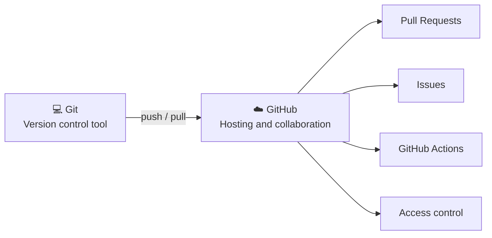

**Remember:**

```text
Git     → Version control tool
GitHub  → Platform for hosting and collaborating on Git repositories
```

---

## 2. Why Git Matters in DevOps

Git is a foundation of DevOps. Every automated pipeline starts with a Git event, such as a push or a merged Pull Request.

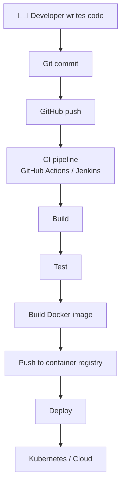

---

## 3. Git Architecture (The Four Areas)

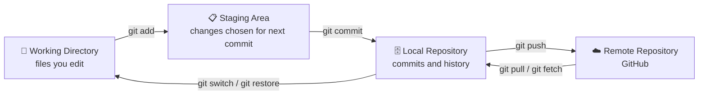

| Area | What it holds | Command that moves data in |
|---|---|---|
| **Working Directory** | The files you are currently editing | (you edit files) |
| **Staging Area** | Changes selected for the next commit | `git add` |
| **Local Repository** | Commits and full history (inside `.git/`) | `git commit` |
| **Remote Repository** | The copy hosted on GitHub | `git push` |

> ⚠️ Don't manually edit the hidden `.git/` folder unless you know exactly what you are doing. It contains the repository's data and history.

---

## 4. Setup and Configuration

```bash
# Create a project and initialize Git
mkdir devops-project
cd devops-project
git init                 # creates the hidden .git/ folder
git status               # check the state of the repo
```

```bash
# One-time identity setup
git config --global user.name  "Your Name"
git config --global user.email "your-email@example.com"

# Verify
git config --list
git config user.name
git config user.email
```

---

## 5. Basic Workflow

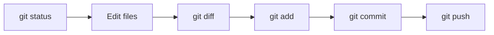

```bash
git status                       # what changed?
git add app.py                   # stage one file
git add app.py Dockerfile        # stage multiple files
git add .                        # stage everything
git commit -m "Add application files"
git log --oneline                # view short history
```

### Writing good commit messages

A commit is a recorded snapshot of staged changes. The message should describe **what changed**.

| ✅ Good | ❌ Avoid |
|---|---|
| `Add Dockerfile` | `changes` |
| `Fix database connection` | `update` |
| `Update Kubernetes deployment` | `final` |
| `Add CI pipeline` | `test`, `abc` |

---

## 6. Status, Diff and Log

### `git status`

Shows the current branch, modified files, untracked files, staged files and unstaged changes. It should be your most frequently used command.

### `git diff`

```bash
git diff                     # unstaged changes
git diff --staged            # staged changes
git diff commit1 commit2     # compare two commits
```

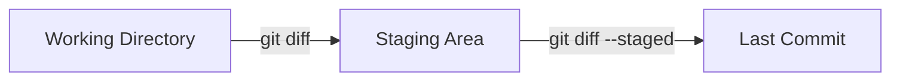

### `git log`

```bash
git log                                   # full history
git log --oneline                         # compact history
git log --oneline --graph --all           # visualize branches
git log --oneline --decorate --graph --all
```

---

## 7. Branches

A branch is an independent line of development.

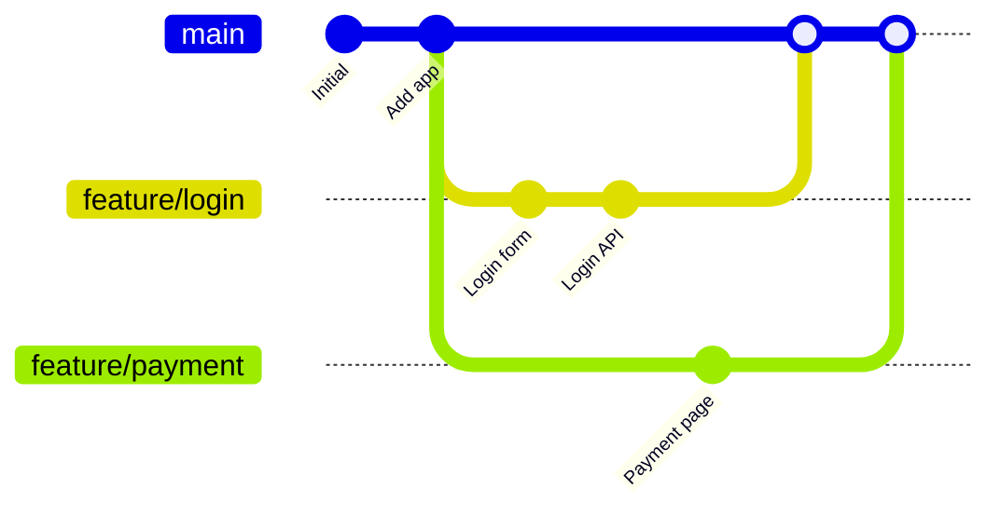

```bash
git branch                       # list branches
git branch feature/login         # create a branch
git switch feature/login         # switch to it
git switch -c feature/login      # create AND switch
git branch -d feature/login      # delete (safe)
git branch -D feature/login      # force delete (use carefully)
```

### Common branch names

```text
main / master     → primary line
develop           → integration branch
feature/*         → new features
release/*         → release preparation
hotfix/*          → urgent production fixes
bugfix/*          → bug fixes
```

### Branching strategies (depends on the company)

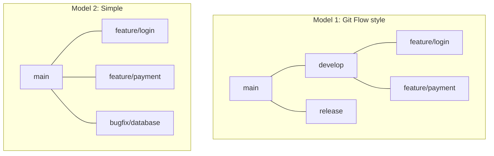

> Don't assume every company uses the same branching strategy.

---

## 8. Merge and Merge Conflicts

### Merge

Merge combines changes from one branch into another.

```bash
git switch main
git merge feature/login
```

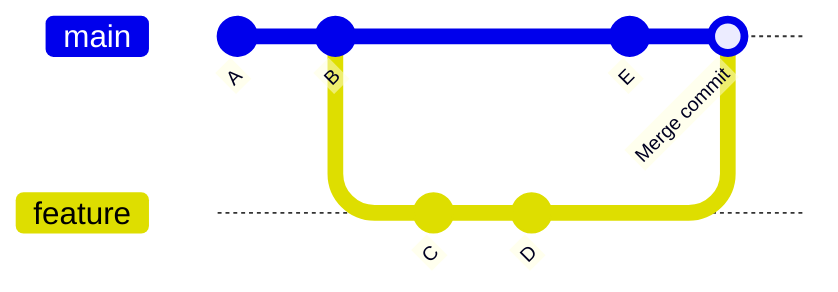

### Merge conflict

A conflict happens when two branches change the **same lines** and Git can't decide which to keep.

> A merge conflict is **not an error**. It simply means Git needs a human to decide how to combine the changes.

Git marks the file like this:

```text
<<<<<<< HEAD
your changes
=======
other branch changes
>>>>>>> feature/login
```

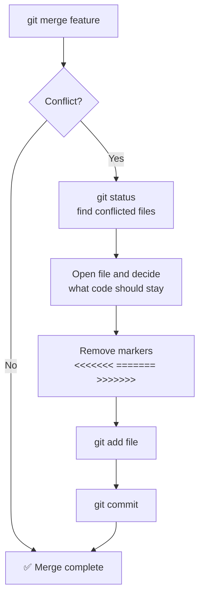

---

## 9. Remotes: Clone, Fetch, Pull, Push

```bash
git remote -v                                              # list remotes
git remote add origin https://github.com/USERNAME/REPO.git # add remote
git clone https://github.com/USERNAME/REPO.git             # download a repo
git push origin main                                       # send commits
git push -u origin feature/login                           # first push of a branch
git fetch origin                                           # download only
git pull                                                   # fetch + integrate
```

- `origin` is the default name for the remote repository.
- `-u` sets the **upstream** so later you can just use `git push` / `git pull`.

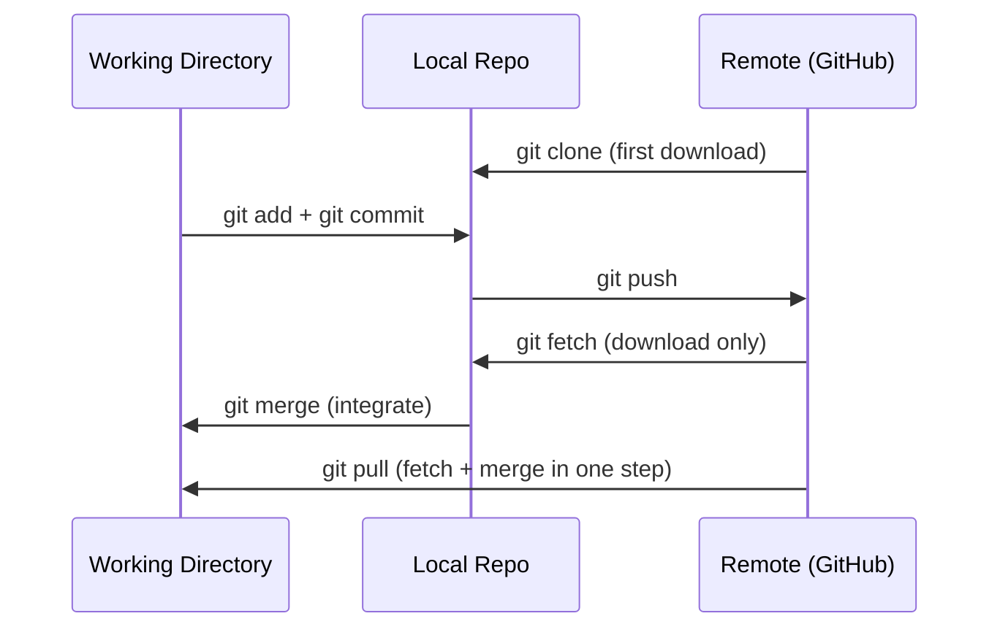

### Fetch vs Pull

| Command | What it does |
|---|---|
| `git fetch` | Downloads remote changes but does **not** merge them |
| `git pull` | `git fetch` + integrate changes into your current branch |

### Remote tracking branches

```bash
git branch -a
```

```text
* main
  feature/login
  remotes/origin/main
  remotes/origin/feature/login
```

---

## 10. Pull Requests and Issues

### Pull Request (PR)

A PR is a proposal to merge changes from one branch into another. It's the heart of professional team workflows.

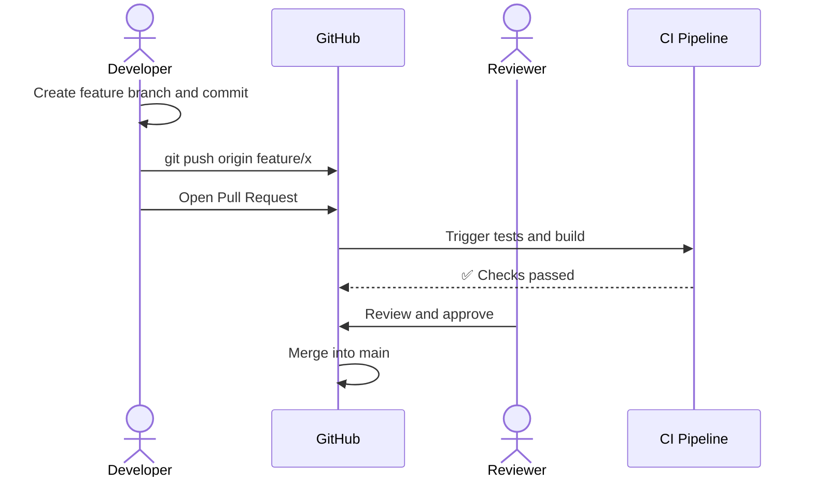

### Issues

Issues track bugs, features, tasks and improvements.

```text
Issue #25 → "Fix PostgreSQL connection failure"
```

A developer creates a branch for the issue, fixes it, and links the PR to the issue.

---

## 11. .gitignore and Secrets

`.gitignore` tells Git which files **not** to track.

```gitignore
.env
*.log
__pycache__/
*.pyc
.venv/
node_modules/
*.pem
```

### 🔐 Never commit

```text
Passwords          API keys          AWS credentials
Private keys       .env files        Tokens
```

Git is **not** a secret-management system.

```python
# ❌ Bad
password = "MyPassword123"

# ✅ Better
import os
password = os.environ.get("DB_PASSWORD")
```

Real DevOps secret management options:

```text
AWS Secrets Manager     Kubernetes Secrets
HashiCorp Vault         GitHub Actions Secrets
```

---

## 12. Undoing Changes

```bash
git restore filename              # discard unstaged changes
git restore --staged filename     # unstage a file
git revert <commit-id>            # new commit that reverses an old one
git reset --soft HEAD~1           # undo last commit, keep changes staged
```

### Revert vs Reset

| | `git revert` | `git reset` |
|---|---|---|
| What it does | Creates a **new commit** that undoes an old one | **Moves** the branch pointer back |
| History | Preserved | Rewritten |
| Safe for shared branches? | ✅ Yes | ❌ No |

### The three reset modes

| Mode | Commit | Staging Area | Working Directory |
|---|---|---|---|
| `--soft` | Undone | Kept (staged) | Kept |
| `--mixed` (default) | Undone | Cleared | Kept |
| `--hard` | Undone | Cleared | ⚠️ **Deleted** |

> ⚠️ `git reset --hard` can permanently remove your local changes. Use it only when you fully understand the consequences.

### Which undo command should I use?

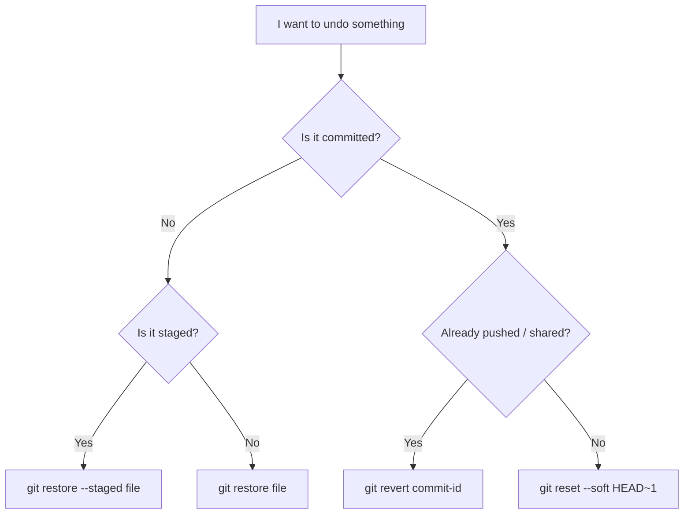

---

## 13. HEAD and Tags

### HEAD

`HEAD` is your current position in Git history, usually the latest commit of the checked-out branch.

```bash
git show HEAD
HEAD~1      # one commit before
HEAD~2      # two commits before
```

### Tags

Tags mark important points in history, usually releases.

```bash
git tag v1.0.0
git tag                       # list tags
git push origin v1.0.0        # push one tag
git push origin --tags        # push all tags
```

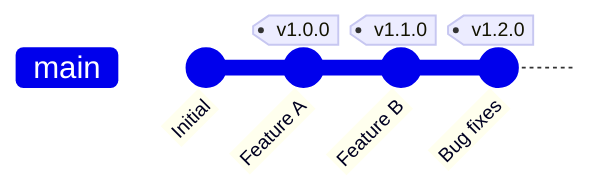

---

## 14. Rebase, Cherry-Pick and Stash

### Rebase

Rebase **replays** your commits on top of another base, creating a cleaner, linear history.

```bash
git switch feature/login
git rebase main
```

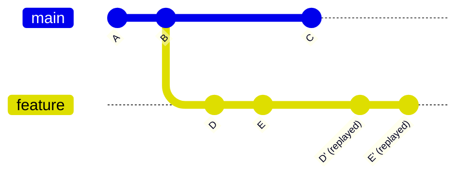

> Before rebase, `feature` starts from **B**. After rebase, its commits (D', E') sit on top of the latest `main` (C).

### Merge vs Rebase

| | Merge | Rebase |
|---|---|---|
| Command | `git merge main` | `git rebase main` |
| History | Preserves branch history, may add a merge commit | Linear, commits are replayed |
| Rewrites history? | No | Yes |
| Golden rule | Safe on shared branches | ⚠️ Avoid rebasing shared/public history |

```text
Merge  → combine histories
Rebase → rewrite / replay commit history
```

### Cherry-pick

Apply **one specific commit** to your current branch without merging the whole branch.

```bash
git cherry-pick <commit-id>
```

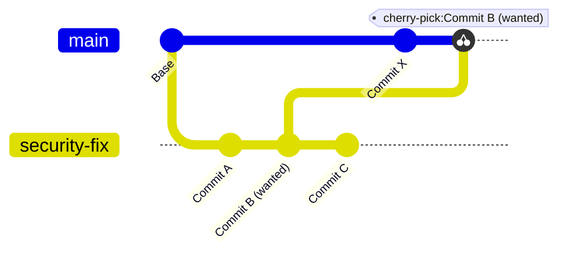

### Stash

Temporarily saves uncommitted work so you can switch tasks.

```bash
git stash            # save work, clean the directory
git stash list       # view saved stashes
git stash apply      # restore, keep it in the stash
git stash pop        # restore and remove from the stash
```

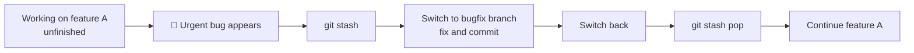

---

## 15. Git in DevOps: CI/CD, Docker, Kubernetes, GitOps

### Git triggers automation

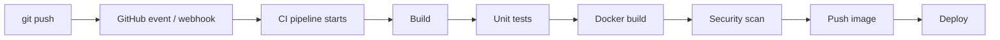

### GitHub Actions

GitHub Actions is GitHub's built-in CI/CD platform. Workflow files live in `.github/workflows/`.

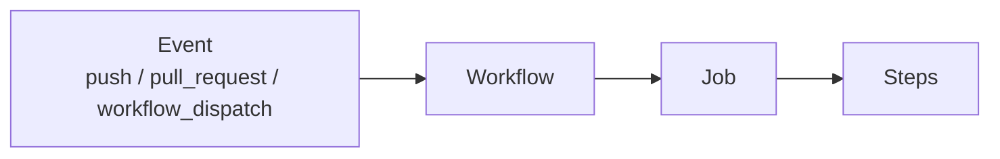

```yaml
# .github/workflows/ci.yml
name: CI
on: [push, pull_request]

jobs:
  build:
    runs-on: ubuntu-latest
    steps:
      - uses: actions/checkout@v4
      - name: Build Docker image
        run: docker build -t my-app .
```

### Git + Docker

```text
my-app/
├── app.py
├── requirements.txt
├── Dockerfile
├── .dockerignore
├── .gitignore
└── README.md
```

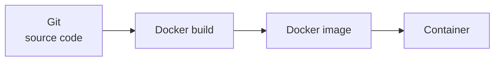

### Git + Kubernetes

```text
devops-app/
├── app/
├── Dockerfile
├── k8s/
│   ├── deployment.yaml
│   └── service.yaml
├── .github/
│   └── workflows/
│       └── deploy.yml
└── README.md
```

Git tracks the application code, Dockerfile, Kubernetes manifests and CI/CD configuration.

> **Infrastructure and deployment configuration can also be version-controlled with Git.** This is the idea behind **Infrastructure as Code (IaC)** and **GitOps**.

### GitOps

GitOps uses Git as the **single source of truth** for the desired state of infrastructure and applications.

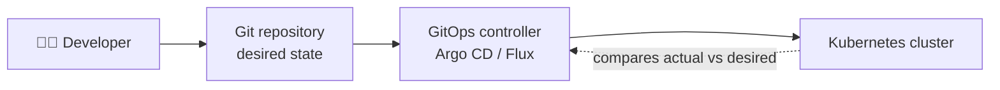

### Complete professional workflow

```mermaid
flowchart TD
    A["1. Clone repository"] --> B["2. Create feature branch"]
    B --> C["3. Develop"]
    C --> D["4. Test locally"]
    D --> E["5. git status and git diff"]
    E --> F["6. git add and git commit"]
    F --> G["7. git push"]
    G --> H["8. Create Pull Request"]
    H --> I["9. Code review"]
    I --> J["10. CI pipeline"]
    J --> K["11. Merge"]
    K --> L["12. Build Docker image"]
    L --> M["13. Deploy"]
```

---

## 16. Troubleshooting

| Problem | What to do |
|---|---|
| **"Your branch is behind origin/main"** | Run `git pull`, but first understand what changes exist before overwriting or resolving conflicts |
| **Merge conflict** | `git status` → fix the files → `git add .` → `git commit` |
| **Accidentally staged a file** | `git restore --staged filename` |
| **Committed by mistake (not pushed)** | `git reset --soft HEAD~1` |
| **Committed by mistake (already pushed)** | `git revert <commit-id>` |
| **Committed a secret** | Revoke/rotate the secret **immediately**. Removing it from a later commit does not remove it from history |
| **Need to switch branches with unfinished work** | `git stash` |

---

## 17. Hands-On Lab

Practice Git through realistic scenarios.

```mermaid
flowchart LR
    A["Create project"] --> B["git init"] --> C["Commit"] --> D["Branch"]
    D --> E["Merge"] --> F["Conflict"] --> G["Stash"] --> H["Rebase"]
    H --> I["Revert"] --> J["Push to GitHub"] --> K["Pull Request"]
```

**Prerequisite:** `git --version` works and you have a GitHub account.

### Scenario 1: Create the project and initialize Git

```bash
mkdir devops-git-lab && cd devops-git-lab
touch app.py Dockerfile README.md
git init
git status          # files show as untracked
```

### Scenario 2: First commit

```bash
echo 'print("Hello DevOps")' > app.py
git add .
git commit -m "Initial DevOps project"
git log --oneline
```

### Scenario 3: Understand `git diff`

```bash
echo 'print("Git is important for DevOps")' >> app.py
git diff                    # shows the new line
git add app.py
git diff                    # now empty (change is staged)
git diff --staged           # shows staged change
git commit -m "Update application message"
```

### Scenario 4: Feature branch and merge

```bash
git switch -c feature/health-check
echo 'print("Health check: OK")' >> app.py
git add app.py
git commit -m "Add health check"

git switch main
git merge feature/health-check
git log --oneline --graph --all
git branch -d feature/health-check
```

### Scenario 5: Create and resolve a merge conflict

```bash
# Branch A
git switch -c feature/version-a
echo 'print("Version A")' >> app.py
git add app.py && git commit -m "Add version A"

# Branch B (from main)
git switch main
git switch -c feature/version-b
echo 'print("Version B")' >> app.py
git add app.py && git commit -m "Add version B"

# Merge both
git switch main
git merge feature/version-a
git merge feature/version-b      # conflict!
```

Then resolve:

```bash
git status                       # find the conflicted file
# open app.py, keep the code you want, delete <<<<<<< ======= >>>>>>>
git add app.py
git commit -m "Resolve version conflict"
git status                       # working tree clean
```

### Scenario 6: Stash

```bash
git switch -c feature/database
echo "PostgreSQL configuration" >> README.md
git stash                        # working directory is now clean
git stash list
git stash pop                    # get your work back
```

### Scenario 7: Rebase

```bash
git switch -c feature/rebase-demo
echo "Rebase practice" >> README.md
git add README.md && git commit -m "Add rebase practice"

git switch main
echo "Main branch update" >> README.md
git add README.md && git commit -m "Update main branch"

git switch feature/rebase-demo
git rebase main
git log --oneline --graph --all
```

### Scenario 8: Revert and Reset

```bash
# Revert: safe, creates a new commit
git log --oneline
git revert <commit-id>

# Reset: moves the branch pointer
echo "Temporary change" >> README.md
git add README.md && git commit -m "Temporary commit"
git reset --soft HEAD~1
git status                       # changes remain staged
```

### Scenario 9: Cherry-pick

```bash
git switch -c feature/security-fix
echo "Never commit secrets to Git" >> README.md
git add README.md && git commit -m "Add security reminder"
git log --oneline                # copy the commit ID

git switch main
git cherry-pick <commit-id>
```

### Scenario 10: `.gitignore`

```bash
cat > .gitignore << 'EOF'
.env
*.log
__pycache__/
.venv/
*.pem
EOF

git add .gitignore
git commit -m "Add Git ignore rules"
```

### Scenario 11: Connect to GitHub and push

Create an **empty** repo on GitHub first, then:

```bash
git remote add origin https://github.com/YOUR_USERNAME/devops-git-lab.git
git remote -v
git branch -M main
git push -u origin main
```

### Scenario 12: Push a feature branch and open a PR

```bash
git switch -c feature/docker
echo "FROM python:3.12-slim" > Dockerfile
git add Dockerfile
git commit -m "Add Docker base image"
git push -u origin feature/docker
```

On GitHub: **Compare & pull request → Review → CI checks → Merge**. Then sync locally:

```bash
git switch main
git pull origin main
git log --oneline --graph --all
```

### 🏆 Final challenge

Complete this **without looking** at the scenarios:

- [ ] Create a repo `devops-practice` with `app.py`, `Dockerfile`, `README.md`, `.gitignore`
- [ ] Make the first commit
- [ ] Create `feature/monitoring`, add monitoring info, commit, push
- [ ] Open a Pull Request
- [ ] Create another branch and intentionally cause a conflict, then resolve it
- [ ] Use `git stash` for unfinished work
- [ ] Inspect history with `git log --oneline --graph --all`
- [ ] Use `git revert` on a test commit
- [ ] Use `git cherry-pick` for one specific commit
- [ ] Connect the repo to a CI/CD pipeline

---

## 18. Cheat Sheet

```bash
# Repository
git init
git clone <url>

# Status and changes
git status
git diff
git diff --staged

# Stage
git add .
git restore --staged <file>

# Commit
git commit -m "message"
git log --oneline

# Branch
git branch
git switch -c <branch>
git switch <branch>
git branch -d <branch>

# Remote
git remote -v
git remote add origin <url>

# Sync
git fetch
git pull
git push

# Integrate
git merge <branch>
git rebase <branch>

# Temporary work
git stash
git stash list
git stash pop

# Undo
git restore <file>
git revert <commit>
git reset --soft HEAD~1

# Specific commit
git cherry-pick <commit>

# Tags
git tag v1.0.0
git push origin v1.0.0

# History
git log --oneline --graph --all
```

### Daily workflow

```mermaid
flowchart LR
    A["git pull"] --> B["Work on code"] --> C["git status"] --> D["git diff"]
    D --> E["git add ."] --> F["git commit"] --> G["git push"]
```

**Practical rule:** `CHECK → CHANGE → DIFF → STAGE → COMMIT → PUSH`

---

## 19. Interview Questions

### Basic

| # | Question | Short answer |
|---|---|---|
| 1 | What is Git? | A distributed version control system that tracks code changes |
| 2 | What is GitHub? | A cloud platform for hosting Git repos and collaborating |
| 3 | Git vs GitHub? | Git is the tool; GitHub is the hosting/collaboration platform |
| 4 | What is a repository? | A project folder plus its full change history (`.git/`) |
| 5 | What is a commit? | A recorded snapshot of staged changes |
| 6 | What is the staging area? | Where you collect changes before committing |
| 7 | `git add` vs `git commit`? | `add` stages changes; `commit` records them in history |
| 8 | What is a branch? | An independent line of development |
| 9 | What is a remote? | A connection to a repository hosted elsewhere (e.g. GitHub) |
| 10 | What is `origin`? | The default name given to the main remote |

### Intermediate

| # | Question | Short answer |
|---|---|---|
| 11 | `fetch` vs `pull`? | `fetch` only downloads; `pull` = fetch + merge |
| 12 | `merge` vs `rebase`? | Merge combines histories; rebase replays commits on a new base |
| 13 | What is a merge conflict? | Two branches changed the same lines and Git needs a human decision |
| 14 | How do you resolve one? | Edit the file, remove markers, `git add`, `git commit` |
| 15 | What is `git stash`? | Temporarily saves uncommitted work |
| 16 | What is `cherry-pick`? | Applies one specific commit to the current branch |
| 17 | `revert` vs `reset`? | Revert adds a new undoing commit (safe); reset moves the branch pointer |
| 18 | What is `.gitignore`? | A file listing what Git should not track |
| 19 | What is HEAD? | The current position in history (usually the current commit) |
| 20 | What is a tag? | A marker for an important point, usually a release |

### DevOps-focused

21. How is Git used in CI/CD?
22. How can GitHub trigger a CI pipeline?
23. How would you integrate GitHub with Jenkins?
24. How is Git used with Docker?
25. How is Git used with Kubernetes?
26. What is GitOps?
27. What is the role of GitHub Actions?
28. How would you protect secrets in a Git repository?
29. What happens when a developer pushes code to GitHub?
30. Explain a complete Git → CI/CD → Docker → Kubernetes workflow.

### Lab self-test (answer without notes)

1. What happens internally when you run `git add .`?
2. You pushed code and created a PR. What happens next in a professional workflow?
3. Two developers changed the same lines. What happens on merge?
4. You have unfinished work and must switch branches. Which feature do you use?
5. A bad commit is already on a shared branch. `reset` or `revert`, and why?
6. Why should `.env` files be in `.gitignore`?

### ⭐ The best answer to: "Explain how you use Git in a DevOps project"

> I use Git for version control and collaboration. I create a feature branch for my changes, make the required code or infrastructure changes, test them locally, and commit.
>
> Then I push the branch to GitHub and create a Pull Request. After code review and successful CI checks, the branch is merged.
>
> The merge or push event triggers a CI/CD pipeline, which builds and tests the application, creates a Docker image, pushes it to a container registry, and deploys the application to the target environment.

---

## 20. Final Revision Checklist

Before an interview, make sure you can explain these **without notes**:

- [ ] Git vs GitHub
- [ ] Repository, working directory, staging area
- [ ] Commit, `git status`, `git diff`, `git log`
- [ ] Branches, merge, merge conflicts
- [ ] Rebase
- [ ] Fetch, pull, push, clone
- [ ] Remote and `origin`
- [ ] Pull Request
- [ ] `.gitignore`
- [ ] Revert vs reset
- [ ] Stash
- [ ] Cherry-pick
- [ ] Tags
- [ ] GitHub Actions
- [ ] Git + Docker
- [ ] Git + Kubernetes
- [ ] Git + CI/CD
- [ ] GitOps
- [ ] Git security and secrets

### 🧠 Golden rule

Don't memorize commands in isolation. **Understand the workflow.**

```mermaid
flowchart TD
    A["Code"] --> B["Git: branch and commit"]
    B --> C["GitHub: push and Pull Request"]
    C --> D["Code review"]
    D --> E["CI: build and test"]
    E --> F["Docker image"]
    F --> G["Container registry"]
    G --> H["Kubernetes / Cloud"]
```

---

## 🙏 Thank You

Thank you for reading these notes! If they helped you:

- ⭐ Star the repository
- 🐛 Open an issue if you spot a mistake
- 🤝 Share it with someone learning Git

Happy learning and happy committing! 🚀

---

**Author:** Shubham Nishane · GitHub: [@shubhamnishane-064](https://github.com/shubhamnishane-064)
