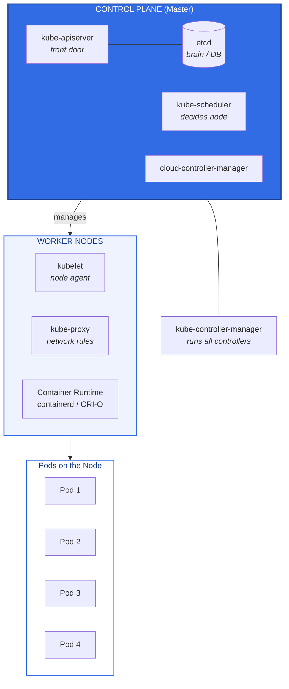

# Kubernetes Interview Notes — Complete Guide

**Author:** Shubham Nishane
**Purpose:** DevOps Interview Preparation

---

## Table of Contents

1. [What is Kubernetes?](#1-what-is-kubernetes)
2. [Kubernetes Architecture](#2-kubernetes-architecture)
3. [Core K8s Objects](#3-core-k8s-objects)
4. [Pod — The Smallest Unit](#4-pod--the-smallest-unit)
5. [Deployment — The Manager](#5-deployment--the-manager)
6. [Service — The Phone Number](#6-service--the-phone-number)
7. [Ingress — The L7 Traffic Cop](#7-ingress--the-l7-traffic-cop)
8. [ConfigMap & Secret](#8-configmap--secret)
9. [Storage — PV, PVC, StorageClass](#9-storage--pv-pvc-storageclass)
10. [Namespace](#10-namespace)
11. [Probes — Health Checks](#11-probes--health-checks)
12. [Scheduling — Where Pods Land](#12-scheduling--where-pods-land)
13. [RBAC — Role-Based Access Control](#13-rbac--role-based-access-control)
14. [Auto-Scaling](#14-auto-scaling)
15. [Troubleshooting — Interview Gold](#15-troubleshooting--interview-gold)
16. [Interview Questions — Quick Answers](#16-interview-questions--quick-answers)
17. [Essential kubectl Commands](#17-essential-kubectl-commands)
18. [YAML — Quick Templates](#18-yaml--quick-templates)
19. [Production Best Practices](#19-production-best-practices)
20. [Quick Reference — One Liners](#20-quick-reference--one-liners)

---

## 1. What is Kubernetes?

**Definition:**
Kubernetes (K8s) is an open-source container orchestration platform that automates deployment, scaling, and management of containerized applications.

**Why we need K8s:**
1. **Self-Healing** — Restarts failed containers automatically
2. **Zero-Downtime Deploy** — Rolling updates without service interruption
3. **Auto-Scaling** — Scales up/down based on traffic
4. **Declarative Config** — YAML files stored in Git (GitOps)
5. **Portability** — Same YAML works on AWS, GCP, Azure, on-prem
6. **Service Discovery** — Built-in DNS and load balancing

**K8s abbreviation:** K + 8 letters (`ubernete`) + s = K8s

**Analogy:** K8s = Orchestra Conductor. You give sheet music (YAML), K8s directs all musicians (containers) automatically.

---

## 2. Kubernetes Architecture



> 💡 GitHub renders the diagram above automatically since it's a fenced ` ```mermaid ` code block — no image file needed.

### Control Plane Components

**1. kube-apiserver**
- The **FRONT DOOR** of the cluster
- Only component that talks to etcd
- Handles: Authentication → Authorization → Admission → Validation
- Stateless (can run multiple replicas)
- Default port: `6443` (HTTPS)

**2. etcd**
- The **BRAIN / DATABASE** of the cluster
- Distributed key-value store
- Stores ALL cluster data (state, config, secrets)
- Uses Raft consensus algorithm
- MUST use odd numbers (3, 5, 7) for quorum
- MUST use SSD (fast disk = fast cluster)
- Backup is **CRITICAL** (snapshot)

**3. kube-scheduler**
- Decides **which node** a Pod runs on
- Two phases:
  - a) Filtering (Predicate) — remove nodes that can't run the Pod
  - b) Scoring (Priority) — rank remaining nodes, pick highest score
- Considers: resources, affinity, taints, topology
- Does **NOT** run containers (that's kubelet's job)

**4. kube-controller-manager**
- Runs all **CONTROLLERS** (reconciliation loops)
- Key controllers: ReplicaSet, Deployment, StatefulSet, DaemonSet, Job/CronJob, Node, Endpoint, ServiceAccount
- Uses **LEADER ELECTION** (only one active at a time)
- If down: cluster freezes but existing apps keep running

**5. cloud-controller-manager**
- Talks to cloud provider APIs (AWS, GCP, Azure)
- Manages: Load Balancers, Storage Volumes, Node lifecycle

### Worker Node Components

**1. kubelet**
- Node agent (runs as systemd service, **NOT** a container)
- Manages Pod lifecycle on the node
- Talks to container runtime via CRI
- Reports node status via LEASES (heartbeats every 10s)
- Runs liveness/readiness probes, mounts volumes
- If down: node marked `NotReady` after 40s, Pods evicted after 5 min

**2. kube-proxy**
- Network rules manager (NOT a traditional proxy)
- Implements Service abstraction
- Modes: `iptables` (default, O(n)), `IPVS` (recommended, O(1)), `userspace` (deprecated)
- If down: existing services work, new ones won't

**3. Container Runtime**
- Actually runs containers (containerd, CRI-O; Docker deprecated)
- Uses CRI (Container Runtime Interface) — gRPC API
- If down: all containers on node stop

---

## 3. Core K8s Objects

| Object | Purpose |
|---|---|
| Pod | Smallest deployable unit (1+ containers) |
| ReplicaSet | Maintains N replicas of a Pod |
| Deployment | Manages ReplicaSets + rolling updates + rollbacks |
| StatefulSet | For stateful apps (DB) — stable identity + storage |
| DaemonSet | Runs 1 Pod per node (logging, monitoring) |
| Job | Run-to-completion task |
| CronJob | Scheduled Job (like Linux cron) |
| Service | Stable IP/DNS for a set of Pods |
| Ingress | L7 HTTP/HTTPS routing from outside |
| ConfigMap | Non-sensitive config (env vars, files) |
| Secret | Sensitive config (base64 encoded) |
| Namespace | Virtual cluster for isolation |
| PersistentVolume | Actual storage resource |
| PersistentVolumeClaim | Request for storage |
| StorageClass | Blueprint for dynamic storage provisioning |
| ServiceAccount | Identity for Pods to talk to API server |
| Role/ClusterRole | Permissions (RBAC) |
| RoleBinding/ClusterRoleBinding | Attach permissions to users/groups |
| NetworkPolicy | Firewall rules for Pods |
| HorizontalPodAutoscaler | Auto-scale based on metrics |

---

## 4. Pod — The Smallest Unit

**Definition:** A Pod is a wrapper around 1 or more containers that share network and storage.

**Key facts:**
- Smallest deployable unit in K8s
- Has ONE IP address (all containers share it)
- Containers inside a Pod talk via `localhost`
- Pods are **EPHEMERAL** — they die and are replaced
- New Pod = New IP address (this is why we need Services)
- Usually 1 container per Pod, but sidecars are common

**Pod lifecycle:**
```
Pending → Running → Succeeded/Failed → (deleted)
```

**Multi-container patterns:**
1. **Sidecar** — Helper (logging, proxy)
2. **Ambassador** — Proxy for external calls
3. **Adapter** — Transform output

---

## 5. Deployment — The Manager

**Definition:** A Deployment manages stateless apps by ensuring N replicas, handling rolling updates, and enabling rollbacks.

**Hierarchy:** `Deployment → ReplicaSet → Pod`

**Key features:**
1. Self-Healing — Recreates crashed Pods
2. Rolling Updates — Zero-downtime updates
3. Rollbacks — Undo bad deployments
4. Scaling — Easy scale up/down
5. Version History — Keep last N revisions

**Update strategies:**
- **RollingUpdate** (default): gradually replace old Pods with new, zero downtime, tune with `maxSurge`/`maxUnavailable`
- **Recreate**: kill all old Pods first, then create new — causes downtime, dev/test only

**Critical parameters:**
- `maxSurge` — extra Pods during update (e.g., 1 or 25%)
- `maxUnavailable` — Pods allowed down during update (0 = zero downtime)
- `revisionHistoryLimit` — old ReplicaSets to keep (default 10)
- `minReadySeconds` — how long a Pod must be ready before considered available

**Best practices:** `maxUnavailable: 0`, `maxSurge: 1`, always define readiness/liveness probes, set resource requests/limits, use specific image tags (not `:latest`).

**Commands:**
```bash
kubectl apply -f deployment.yaml
kubectl get deployments
kubectl describe deployment <name>
kubectl scale deployment <name> --replicas=5
kubectl rollout status deployment/<name>
kubectl rollout history deployment/<name>
kubectl rollout undo deployment/<name>
kubectl rollout undo deployment/<name> --to-revision=2
kubectl rollout pause deployment/<name>
kubectl rollout resume deployment/<name>
kubectl rollout restart deployment/<name>
```

---

## 6. Service — The Phone Number

**Definition:** A Service is a stable IP and DNS name for a set of Pods, enabling reliable communication even when Pods die and are recreated.

**Why we need it:** Pods die and get new IPs. Service gives a permanent address.

**Service types:**

| Type | Description | Use For |
|---|---|---|
| ClusterIP (default) | Internal only | Microservice-to-microservice |
| NodePort | Exposes on each Node's IP at a static port (30000–32767) | Dev/test, simple external access |
| LoadBalancer | Provisions a cloud LB, gives a public IP | Production external access (costs $ per service) |
| ExternalName | Maps to an external DNS (CNAME), no proxy | External service aliasing |

**Key fields:** `port` (Service port), `targetPort` (container port), `nodePort` (external port, NodePort only), `selector` (labels to match Pods)

**DNS format:** `<service-name>.<namespace>.svc.cluster.local`
Example: `backend-service.default.svc.cluster.local`

**Debugging:**
```bash
kubectl get endpoints <service-name>   # CRITICAL — if EMPTY, selector mismatch!
kubectl describe svc <name>
kubectl get pods -l app=backend
```

**Headless Service:** `clusterIP: None` — no load balancing, returns Pod IPs directly via DNS, used for StatefulSets.

**Session Affinity:** `sessionAffinity: ClientIP` — same client IP always goes to same Pod.

---

## 7. Ingress — The L7 Traffic Cop

**Definition:** Ingress routes external HTTP/HTTPS traffic to internal Services based on hostname or URL path.

**Two parts (both required):**
1. **Ingress Resource** — YAML with routing rules
2. **Ingress Controller** — software that enforces rules (NGINX, Traefik, ALB)

**Why Ingress:** one LoadBalancer for all services, TLS termination, host-based routing, path-based routing.

**Popular controllers:** NGINX Ingress, Traefik, HAProxy, AWS ALB Ingress, GCE Ingress

**Path types:** `Exact`, `Prefix`, `ImplementationSpecific`

**TLS:** store cert in a Secret → reference in Ingress spec → controller terminates TLS.

---

## 8. ConfigMap & Secret

**ConfigMap:** non-sensitive config, plain text (NOT encrypted), namespaced, 1 MiB limit, injected as env vars or volume mounts.

**Secret:** sensitive data (passwords, API keys, TLS certs), base64 encoded (**NOT encrypted by default!**), namespaced, 1 MiB limit.

> ⚠️ **Critical interview point:** Base64 is NOT security! Anyone can decode it: `echo "value" | base64 --decode`

**To truly secure Secrets:**
1. Enable Encryption at Rest in etcd
2. Use RBAC to restrict access
3. Use External Secrets Operator (ESO) with Vault/AWS Secrets Manager

**Injection methods:**
- `env` (individual keys) — frozen at startup
- `envFrom` (all keys) — frozen at startup
- `volumeMount` (as files) — auto-updated (~60s)
- `subPath` mount — NOT auto-updated

**Secret types:** `Opaque`, `kubernetes.io/tls`, `kubernetes.io/dockerconfigjson`, `kubernetes.io/basic-auth`, `kubernetes.io/ssh-auth`, `kubernetes.io/service-account-token`

**Commands:**
```bash
kubectl create configmap <name> --from-literal=key=value
kubectl create secret generic <name> --from-literal=key=value
kubectl get configmaps
kubectl get secrets
kubectl describe secret <name>
kubectl get secret <name> -o jsonpath='{.data.key}' | base64 --decode
```

---

## 9. Storage — PV, PVC, StorageClass

**PersistentVolume (PV):** actual storage resource, cluster-scoped, created by admin or dynamically — *like a physical hard drive*.

**PersistentVolumeClaim (PVC):** request for storage by a developer, namespaced — *like a rental agreement*. Pod references PVC, not PV directly.

**StorageClass:** blueprint for dynamic provisioning (e.g., `gp2` on AWS, `standard` on GKE, `managed-premium` on Azure).

**Lifecycle:**
1. Admin creates PV (or StorageClass for dynamic)
2. Developer creates PVC
3. K8s binds PVC to matching PV
4. Pod mounts PVC
5. Data persists across Pod restarts

**Access modes:** `ReadWriteOnce (RWO)`, `ReadOnlyMany (ROX)`, `ReadWriteMany (RWX)`, `ReadWriteOncePod (RWOP)` (K8s 1.22+)

**Reclaim policies:** `Retain` (best for prod DBs), `Delete`, `Recycle` (deprecated)

**Dynamic provisioning:** PVC with `storageClassName` → K8s auto-creates PV → binds

---

## 10. Namespace

**Definition:** Virtual cluster inside a physical cluster for isolation and organization.

**Default namespaces:** `default`, `kube-system`, `kube-public`, `kube-node-lease`

**Use cases:** separate environments (dev/staging/prod), separate teams, resource quotas per team, RBAC isolation.

**Resource Quotas:** limit total CPU, memory, object count per namespace; prevents one team from hogging resources.

**Commands:**
```bash
kubectl get namespaces
kubectl create namespace <name>
kubectl delete namespace <name>
kubectl config set-context --current --namespace=<name>
kubectl get pods -n <namespace>
kubectl get pods -A
```

---

## 11. Probes — Health Checks

| Probe | Question | If Fails | Use For |
|---|---|---|---|
| `livenessProbe` | "Is the app alive?" | Restart the container | Deadlock detection |
| `readinessProbe` | "Is the app ready to serve traffic?" | Stop sending traffic (removed from Endpoints) | Startup delay, temporary overload |
| `startupProbe` | "Has the app finished starting?" | Disables liveness/readiness until it passes | Slow-starting apps (Java, ML models) |

**Probe methods:** `httpGet`, `tcpSocket`, `exec` (exit code 0 = success), `grpc` (K8s 1.24+)

**Key parameters:** `initialDelaySeconds`, `periodSeconds`, `timeoutSeconds`, `failureThreshold`, `successThreshold`

**Best practice:** ALWAYS define readinessProbe and livenessProbe; use startupProbe for slow-starting apps.

---

## 12. Scheduling — Where Pods Land

**Node Selector:** `nodeSelector: disktype=ssd` — Pod only schedules on nodes with matching labels.

**Node Affinity:** more expressive than nodeSelector — `requiredDuringScheduling` (hard) / `preferredDuringScheduling` (soft).

**Pod Affinity / Anti-Affinity:** schedule Pods relative to other Pods — Affinity ("run near this Pod") / Anti-Affinity ("never run near this Pod").

**Taints & Tolerations:**
- Taint on NODE → repels Pods
- Toleration on POD → allows scheduling on tainted node
- Effects: `NoSchedule`, `PreferNoSchedule`, `NoExecute` (evict existing Pods)

**Topology Spread Constraints:** spread Pods evenly across zones/regions/nodes for HA.

**Priority Classes:** high-priority Pods can preempt (evict) low-priority Pods.

---

## 13. RBAC — Role-Based Access Control

**Four objects:**
1. **Role** — permissions within a namespace
2. **ClusterRole** — permissions cluster-wide
3. **RoleBinding** — attaches Role to User/Group/ServiceAccount (namespaced)
4. **ClusterRoleBinding** — attaches ClusterRole cluster-wide

**Subjects:** User, Group, ServiceAccount

**Common verbs:** `get, list, watch, create, update, patch, delete, deletecollection`

**Example Role:**
```yaml
apiVersion: rbac.authorization.k8s.io/v1
kind: Role
metadata:
  namespace: default
  name: pod-reader
rules:
- apiGroups: [""]
  resources: ["pods"]
  verbs: ["get", "list", "watch"]
```

**Check permissions:**
```bash
kubectl auth can-i create pods
kubectl auth can-i delete deployments --as=system:serviceaccount:default:my-sa
```

---

## 14. Auto-Scaling

**Horizontal Pod Autoscaler (HPA):** scales number of Pod replicas based on CPU/Memory/custom metrics.
```bash
kubectl autoscale deployment <name> --min=2 --max=10 --cpu-percent=80
```
Requires Metrics Server installed.

**Vertical Pod Autoscaler (VPA):** adjusts CPU/Memory requests and limits based on historical usage.

**Cluster Autoscaler:** adds/removes NODES in the cloud, triggers when Pods are Pending. Works with AWS ASG, GCP MIG, Azure VMSS.

**KEDA:** scales based on external events (Kafka, RabbitMQ, SQS); can scale to zero.

---

## 15. Troubleshooting — Interview Gold

**Pod stuck in `Pending`**
- Causes: insufficient CPU/Memory, PVC not bound, taints without tolerations, node selector mismatch
- Debug: `kubectl describe pod <name>` → check Events

**Pod stuck in `CrashLoopBackOff`**
- Causes: app crashes on startup, missing env var/secret, OOMKilled
- Debug:
```bash
kubectl logs <pod>
kubectl logs <pod> --previous
kubectl describe pod <name>   # check State/Last Terminated Reason
```

**Pod stuck in `ImagePullBackOff`**
- Causes: wrong image name/tag, private registry auth missing, registry unreachable
- Debug: `kubectl describe pod <name>` → check Events, check `imagePullSecrets`

**Service not working**
1. `kubectl get endpoints <service-name>` — if EMPTY → label selector mismatch!
2. Check `targetPort` matches `containerPort`
3. Check Pods are Ready
4. Check kube-proxy logs

**Node `NotReady`**
- Causes: kubelet down, network partition, disk/memory pressure
- Debug: `kubectl describe node <name>`, `systemctl status kubelet`, `journalctl -u kubelet -f`

**OOMKilled:** container exceeded memory limit. Fix: increase limits or fix memory leak. Check `kubectl describe pod` → `Reason: OOMKilled`.

**Evicted Pods:** node under resource pressure, kubelet evicts BestEffort Pods first. Fix: set proper requests/limits.

---

## 16. Interview Questions — Quick Answers

| Question | Answer |
|---|---|
| kube-apiserver goes down? | kubectl fails; existing Pods keep running (kubelet independent); control plane frozen, not dead |
| etcd goes down? | No new changes possible; MUST have backups — without one, cluster is unrecoverable |
| kube-scheduler goes down? | New Pods stay Pending forever; existing Pods unaffected |
| kube-controller-manager goes down? | Self-healing stops; no new deployments/scaling/rollbacks; existing Pods keep running |
| kubelet goes down? | Node NotReady after 40s, Pods evicted after 5 min; containers keep running (runtime independent) |
| kube-proxy goes down? | Existing Services work; new Services unreachable from that node |
| Service vs Ingress? | Service = L4 internal. Ingress = L7 external |
| Deployment vs StatefulSet? | Deployment = stateless, interchangeable Pods. StatefulSet = stable identity + storage |
| Deployment vs DaemonSet? | Deployment = N replicas anywhere. DaemonSet = exactly 1 per node |
| What is a Headless Service? | `clusterIP: None`; returns Pod IPs directly via DNS; used for StatefulSets |
| Why can't I ping a ClusterIP? | It's a virtual IP in iptables/IPVS; no interface responds to ICMP |
| port vs targetPort vs nodePort? | port = Service port, targetPort = container port, nodePort = node port |
| maxSurge vs maxUnavailable? | maxSurge = extra Pods during update. maxUnavailable = Pods allowed down |
| What is a rolling update? | Gradually replace old Pods with new — zero downtime |
| How do you rollback? | `kubectl rollout undo deployment/<name>` |
| What is the reconciliation loop? | K8s constantly compares desired vs current state and fixes drift |
| ConfigMap vs Secret? | ConfigMap = non-sensitive, plain text. Secret = sensitive, base64 (not encrypted by default) |
| What is a PV and PVC? | PV = actual storage. PVC = request for storage |
| What is a StorageClass? | Blueprint for dynamic PV provisioning |
| What is RBAC? | Role + RoleBinding (namespaced) or ClusterRole + ClusterRoleBinding (cluster-wide) |
| What is a ServiceAccount? | Identity for Pods to authenticate to the API server |
| What is a NetworkPolicy? | Firewall rules for Pods (ingress/egress) |
| What is HPA? | Horizontal Pod Autoscaler — scales replicas based on metrics |
| Liveness vs readiness probe? | Liveness = restart container. Readiness = stop sending traffic |
| What is a Static Pod? | Pod defined by a file on disk (`/etc/kubernetes/manifests/`); managed by kubelet, not API server |
| What is a Namespace? | Virtual cluster for isolation and organization |
| How does DNS work in K8s? | CoreDNS resolves `<service>.<namespace>.svc.cluster.local` |

---

## 17. Essential kubectl Commands

**Viewing:**
```bash
kubectl get pods
kubectl get pods -A
kubectl get pods -o wide
kubectl get pods -o yaml
kubectl get all -A
kubectl get nodes
kubectl get svc
kubectl get deployments
kubectl get configmaps
kubectl get secrets
kubectl get events --sort-by='.lastTimestamp'
kubectl top pods
kubectl top nodes
```

**Describing:**
```bash
kubectl describe pod <name>
kubectl describe node <name>
kubectl describe svc <name>
kubectl describe deployment <name>
```

**Creating/Updating:**
```bash
kubectl apply -f <file.yaml>
kubectl create -f <file.yaml>
kubectl create deployment <name> --image=<image>
kubectl create ns <name>
kubectl create secret generic <name> --from-literal=key=value
kubectl edit <resource> <name>
kubectl patch <resource> <name> -p '{...}'
```

**Deleting:**
```bash
kubectl delete -f <file.yaml>
kubectl delete pod <name>
kubectl delete pod <name> --force --grace-period=0
kubectl delete ns <name>
```

**Debugging:**
```bash
kubectl logs <pod>
kubectl logs <pod> -c <container>
kubectl logs <pod> --previous
kubectl logs -f <pod>
kubectl exec -it <pod> -- /bin/bash
kubectl port-forward pod/<pod> 8080:80
kubectl port-forward svc/<svc> 8080:80
kubectl cp <pod>:/path/file ./file
kubectl debug <pod> -it --image=busybox
```

**Scaling/Rollouts:**
```bash
kubectl scale deployment <name> --replicas=5
kubectl autoscale deployment <name> --min=2 --max=10
kubectl rollout status deployment/<name>
kubectl rollout history deployment/<name>
kubectl rollout undo deployment/<name>
kubectl rollout restart deployment/<name>
```

**Context/Config:**
```bash
kubectl config view
kubectl config get-contexts
kubectl config current-context
kubectl config use-context <name>
kubectl config set-context --current --namespace=<ns>
```

**Node Management:**
```bash
kubectl cordon <node>
kubectl uncordon <node>
kubectl drain <node> --ignore-daemonsets
kubectl taint nodes <node> key=value:NoSchedule
kubectl taint nodes <node> key=value:NoSchedule-
```

**Other:**
```bash
kubectl cluster-info
kubectl version
kubectl api-resources
kubectl explain pods.spec.containers
kubectl auth can-i create pods
kubectl wait --for=condition=ready pod <name>
```

---

## 18. YAML — Quick Templates

**Pod:**
```yaml
apiVersion: v1
kind: Pod
metadata:
  name: my-pod
spec:
  containers:
  - name: app
    image: nginx:latest
    ports:
    - containerPort: 80
```

**Deployment:**
```yaml
apiVersion: apps/v1
kind: Deployment
metadata:
  name: my-deploy
spec:
  replicas: 3
  selector:
    matchLabels:
      app: my-app
  template:
    metadata:
      labels:
        app: my-app
    spec:
      containers:
      - name: app
        image: nginx:latest
        ports:
        - containerPort: 80
```

**Service:**
```yaml
apiVersion: v1
kind: Service
metadata:
  name: my-svc
spec:
  type: ClusterIP
  selector:
    app: my-app
  ports:
  - port: 80
    targetPort: 80
```

**ConfigMap:**
```yaml
apiVersion: v1
kind: ConfigMap
metadata:
  name: my-config
data:
  KEY: value
```

**Secret:**
```yaml
apiVersion: v1
kind: Secret
metadata:
  name: my-secret
type: Opaque
stringData:
  password: mypassword
```

**PVC:**
```yaml
apiVersion: v1
kind: PersistentVolumeClaim
metadata:
  name: my-pvc
spec:
  accessModes:
  - ReadWriteOnce
  resources:
    requests:
      storage: 10Gi
  storageClassName: gp2
```

---

## 19. Production Best Practices

1. ALWAYS set resource requests and limits
2. ALWAYS define liveness and readiness probes
3. NEVER use `:latest` tag in production
4. NEVER hardcode secrets in code or Dockerfiles
5. Use Namespaces for isolation
6. Use RBAC with least privilege
7. Enable Network Policies (default deny)
8. Use PodDisruptionBudgets for HA
9. Use multiple replicas (spread across nodes/zones)
10. Use anti-affinity to spread replicas
11. Enable audit logging
12. Enable Encryption at Rest for etcd
13. Regular etcd backups
14. Use GitOps (ArgoCD/Flux) for deployments
15. Use Helm for templating
16. Monitor with Prometheus + Grafana
17. Log with EFK/ELK stack
18. Use OPA Gatekeeper / Kyverno for policy enforcement
19. Set up HPA for auto-scaling
20. Use External Secrets Operator for secrets

---

## 20. Quick Reference — One Liners

- K8s is a "Desired State" engine.
- API Server is the only component that talks to etcd.
- etcd is the brain — lose it, lose the cluster.
- Scheduler = decision maker (which node).
- Controller Manager = action taker (creates/deletes resources).
- kubelet = node agent (manages Pods on the node).
- kube-proxy = network rules manager (implements Services).
- Pod = smallest unit (1+ containers sharing network).
- Deployment = self-healing + rolling updates for stateless apps.
- Service = permanent IP/DNS for a set of Pods.
- Ingress = L7 HTTP/HTTPS router (saves LoadBalancer costs).
- ConfigMap = non-sensitive config.
- Secret = sensitive config (base64, NOT encrypted by default).
- PV = actual storage. PVC = request for storage.
- Namespace = virtual cluster.
- Liveness = restart container. Readiness = stop traffic.
- HPA = scale replicas. CA = scale nodes.
- RBAC = Role + RoleBinding (namespaced) or ClusterRole + ClusterRoleBinding.
- Always check `kubectl get endpoints` first when debugging Services.
- Base64 is NOT encryption.
- `maxUnavailable: 0` = zero downtime.

---

*End of notes.*
