# 🐧 Linux for DevOps — Notes, Troubleshooting & Interview Prep

> A practical Linux reference for daily work, quick troubleshooting, and interview revision.

**Level:** Beginner → Intermediate → DevOps Interview
**Author:** Shubham Nishane

> 💡 Diagrams are written in [Mermaid](https://mermaid.js.org/) and render automatically on GitHub.

---

## 📑 Table of Contents

1. [Linux Fundamentals](#1-linux-fundamentals)
2. [Filesystem Layout](#2-filesystem-layout)
3. [Users & Groups](#3-users--groups)
4. [sudo & Least Privilege](#4-sudo--least-privilege)
5. [Permissions & Ownership](#5-permissions--ownership)
6. [Shells](#6-shells)
7. [Files & Packages](#7-files--packages)
8. [Processes & Signals](#8-processes--signals)
9. [systemd, Services & Logs](#9-systemd-services--logs)
10. [Disks, Partitions & Filesystems](#10-disks-partitions--filesystems)
11. [SSH](#11-ssh)
12. [Networking](#12-networking)
13. [OSI Model, TCP/IP & Ports](#13-osi-model-tcpip--ports)
14. [Backup, Compression & Cron](#14-backup-compression--cron)
15. [🚑 Troubleshooting Cheat Sheet](#15--troubleshooting-cheat-sheet)
16. [🎯 Interview Questions](#16--interview-questions)
17. [Golden Rules for Production Linux](#17-golden-rules-for-production-linux)

---

## 1. Linux Fundamentals

Linux is an open-source **kernel**. A full distribution combines the kernel with user-space tools, a shell, a package manager and services.

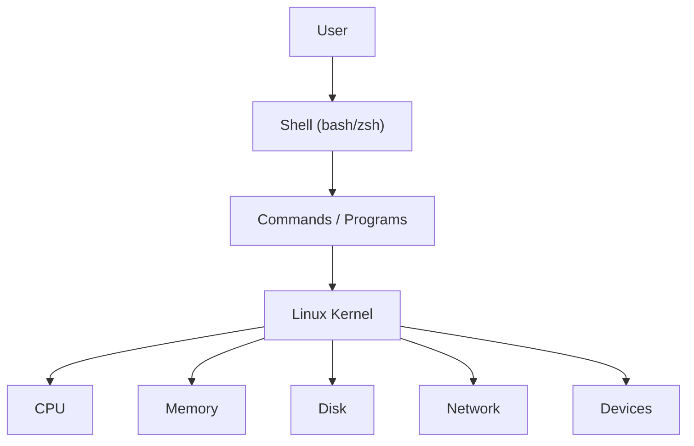

### Why it matters in DevOps

- Most cloud/server workloads and almost all containers run on Linux.
- Strong CLI and automation support (scripting, cron, systemd).
- Pairs naturally with SSH, CI/CD pipelines and infrastructure-as-code.

---

## 2. Filesystem Layout

Everything starts at a single root, `/`.

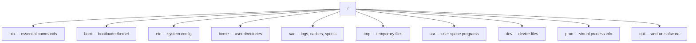

| Directory | Holds |
|---|---|
| `/etc` | System-wide config: `passwd`, `shadow`, `sudoers`, `fstab`, `hosts`, `ssh/sshd_config` |
| `/dev` | Device nodes: `sda`, `nvme0n1`, `null`, `zero`, `random` |
| `/var` | Logs, caches, spools, databases |
| `/proc`, `/sys` | Virtual, kernel-generated info (not real files on disk) |
| `/home` | Regular users' personal directories |

> There's **no fixed rule** that every system has exactly N top-level directories — the layout varies by distro and mounted filesystems.

### If `/tmp` (or another key directory) gets deleted

Don't just `mkdir /tmp` and move on — ownership, permissions, the **sticky bit**, and mount configuration may all matter.


Typical `/tmp` permissions:
```bash
ls -ld /tmp
# drwxrwxrwt root root /tmp   ← trailing 't' is the sticky bit
```

---

## 3. Users & Groups

| User type | Meaning |
|---|---|
| Regular user | Normal login account |
| sudo-capable user | A regular account allowed to run commands via `sudo` |
| root | UID 0, the superuser |
| System/service user | Non-human account used by a service |

> A "sudo user" is still a regular user — `sudo` is a privilege mechanism, not a different account type.

```bash
# Identity
whoami; id; who; w; last
getent passwd ubuntu

# Create / manage users
sudo useradd -m -s /bin/bash ubuntu
sudo passwd ubuntu
sudo usermod -aG sudo ubuntu     # Debian/Ubuntu admin group
sudo usermod -aG wheel ubuntu    # RHEL/Fedora admin group
sudo userdel -r ubuntu           # delete user + home dir

# Groups
sudo groupadd devops
sudo usermod -aG devops ubuntu
sudo gpasswd -d ubuntu devops    # remove from group
```

**`chgrp` vs `newgrp`**
```text
chgrp  → change a file/directory's group ownership
newgrp → switch the CURRENT SHELL's effective group
```

---

## 4. sudo & Least Privilege

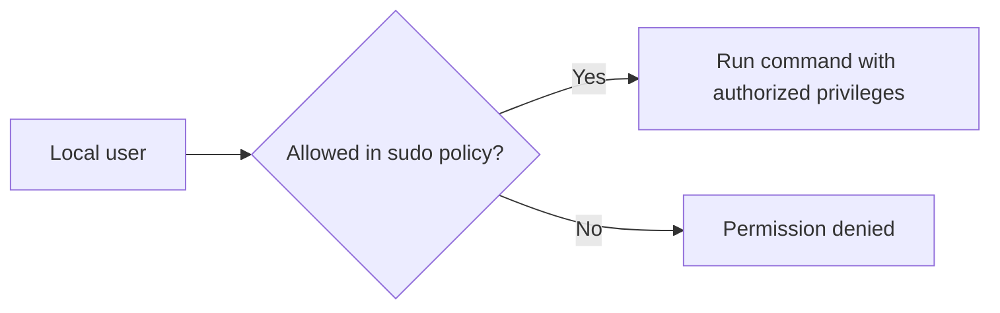

- Policy file: `/etc/sudoers` (plus `/etc/sudoers.d/`)
- **Always edit with `visudo`** — it validates syntax before saving, so you can't lock yourself out with a typo.

```bash
sudo visudo
```

### Grant one command only (least privilege)

```text
ubuntu ALL=(root) NOPASSWD: /usr/bin/systemctl restart nginx
```

Always use **exact command paths** — this is how you avoid handing out more access than intended.

### Why `sudo rm -rf ...` can still fail

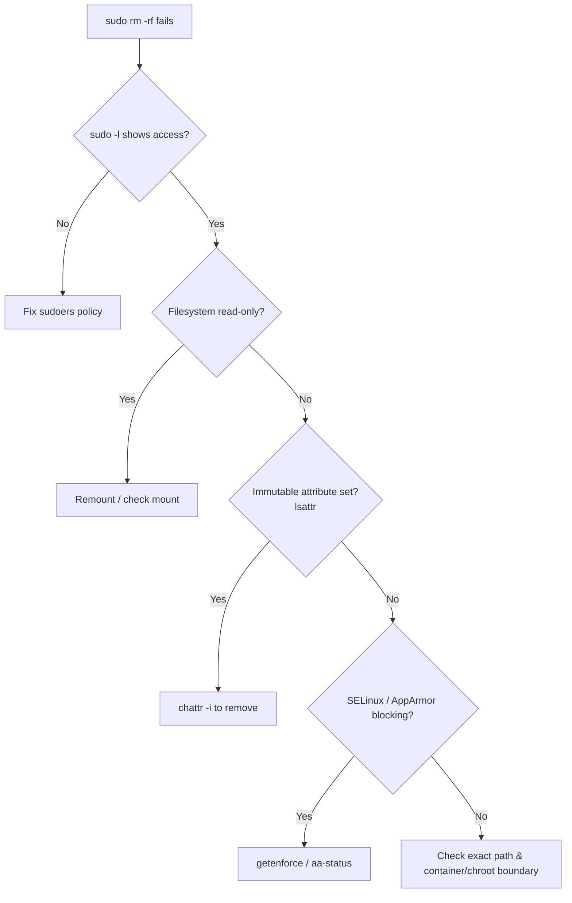

```bash
sudo -l                      # what am I actually allowed to do?
mount | grep ' ro[ ,]'       # read-only mount?
lsattr -d /path/to/file      # immutable flag?
getfacl /path/to/file        # ACL restriction?
getenforce                   # SELinux
sudo aa-status                # AppArmor
```

---

## 5. Permissions & Ownership

```text
          user   group  others
            |      |      |
-rwxr-x---  rwx    r-x    ---
```

```text
r = read (4)    w = write (2)    x = execute (1)
```

| Numeric | Meaning |
|---|---|
| 7 | rwx |
| 6 | rw- |
| 5 | r-x |
| 4 | r-- |
| 0 | --- |

```bash
chmod 755 script.sh          # owner rwx, group r-x, others r-x
chmod u+rwx,g+rx,o-rwx script.sh   # symbolic mode
chmod 600 private.key        # owner-only read/write
sudo chown ubuntu:devops database
sudo chgrp devops database
```

> ⚠️ **Avoid `chmod 777` as a generic fix.** It grants far more access than most apps need. Use **ACLs** or proper group ownership instead.

### Scenario: one user needs read/write, another group read-only

```bash
sudo setfacl -m u:ubuntu:rwx database   # x needed to traverse a directory
sudo setfacl -m o:r-x database
getfacl database
```

Or, group-based:
```bash
sudo groupadd dbadmins
sudo usermod -aG dbadmins ubuntu
sudo chown root:dbadmins database
sudo chmod 750 database
```

### Check tools
```bash
ls -l ; stat file ; namei -l /path/to/file ; getfacl file
```

---

## 6. Shells

```bash
cat /etc/shells          # list available login shells
echo "$SHELL"            # current shell
chsh -s /bin/zsh          # change your own shell
sudo chsh -s /bin/zsh ubuntu   # change another user's shell
```

`/etc/skel/` holds default dotfiles (`.bashrc`, `.profile`) copied into a **new** user's home directory — not re-copied on every login.

```bash
# Restore a deleted .bashrc for an existing user
sudo cp -a /etc/skel/.bashrc /home/ubuntu/
sudo chown ubuntu:ubuntu /home/ubuntu/.bashrc
```

---

## 7. Files & Packages

```bash
pwd ; ls -lah ; mkdir -p project/logs ; cp -r dir1 dir2
mv old new ; rm -rf directory ; find /var/log -type f -name '*.log'
```

| Command | Behavior |
|---|---|
| `rmdir dir` | Removes an **empty** directory only |
| `rm -r dir` | Recursive, may prompt |
| `rm -rf dir` | Recursive + force — ⚠️ dangerous, no prompts |

**Safety habit before destructive commands:**
```bash
pwd ; ls -la ; readlink -f /path
```

### Package managers

```bash
cat /etc/os-release    # identify the distro first!

# Debian/Ubuntu (APT)
sudo apt update && sudo apt install nginx
sudo apt remove nginx ; sudo apt purge nginx

# RHEL/Fedora (DNF)
sudo dnf install nginx
sudo dnf remove nginx
```

---

## 8. Processes & Signals

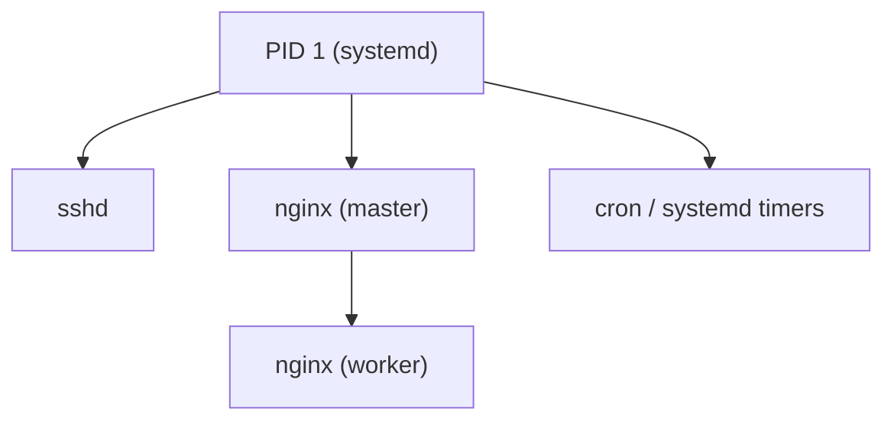

```bash
ps aux ; ps -ef ; pgrep -af apiworker ; pidof nginx
```

### Signals

| Signal | Meaning |
|---|---|
| `SIGTERM` (15) | Ask for graceful shutdown |
| `SIGKILL` (9) | Force-kill immediately, can't be caught |
| `SIGSTOP` (19) | Suspend |
| `SIGUSR2` (12) | App-defined, not "kill" |

```bash
kill -15 999      # graceful (try first)
kill -9 999       # forceful (last resort)
pkill -f apiworker
```

> Use the **least destructive** signal that solves the problem.

### Priority: `nice` / `renice`

```bash
ps -p 999 -o pid,ni,pri,comm
sudo renice -n -5 -p 999     # more negative = higher priority
```
Range: `-20` (highest priority) to `19` (lowest).

### Foreground / background / daemon / zombie

```bash
./app &        # run in background
jobs ; fg %1 ; bg %1
```

```text
Ctrl+C → SIGINT (stop foreground process)
Ctrl+Z → suspend, then `bg` to resume in background
```

A **zombie** is a finished child process whose exit status the parent hasn't collected yet. You don't kill it — you fix/restart the **parent**.

```bash
ps aux | awk '$8 ~ /Z/ {print}'
```

### `top` vs `htop` vs `ps`

| | `ps -elf` | `top` / `htop` |
|---|---|---|
| Style | Snapshot | Live, continuously updating |
| Best for | Scripts, grep/awk | Watching CPU/memory in real time |
| Interactive | No | Yes (`htop` is friendlier) |

---

## 9. systemd, Services & Logs

```bash
sudo systemctl status nginx
sudo systemctl start|stop|restart|reload nginx
sudo systemctl enable --now nginx
```

```text
reload  → re-read config without full stop/start (if supported)
restart → full stop then start
```

### Service troubleshooting flow

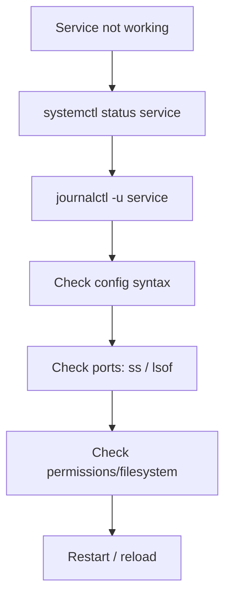

### Logs — `journalctl`

```bash
journalctl -u nginx --since "1 hour ago"
journalctl -f                # follow, live
journalctl -p err -b         # errors since last boot
journalctl -k                # kernel messages
ls -lah /var/log             # traditional log files too
```

---

## 10. Disks, Partitions & Filesystems

```text
Disk → physical/virtual block device
Partition → a region defined on a disk
Filesystem → structure used to store files
Mount point → directory where a filesystem is attached
```

```bash
lsblk ; lsblk -f ; blkid
df -h ; du -sh /var/log
mount ; findmnt ; cat /etc/fstab
```

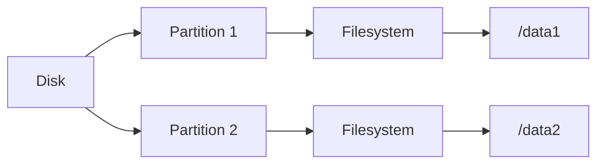

### Create + mount a new partition (⚠️ destructive — test disk only)

```bash
sudo fdisk /dev/sdb
#  n → new  |  p → primary  |  +60G → size  |  w → write

sudo mkfs.ext4 /dev/sdb1
sudo mkdir -p /data1
sudo mount /dev/sdb1 /data1
blkid /dev/sdb1               # get UUID, then add to /etc/fstab to persist
```

### Growing an existing partition

Growing the **partition** is not the same as growing the **filesystem** — usually you need both:

```bash
sudo resize2fs /dev/sdb1        # ext4
sudo xfs_growfs /mountpoint     # XFS (grown while mounted)
```

LVM adds a layer between disk and filesystem:
```text
Disk → Partition/PV → Volume Group → Logical Volume → Filesystem
```

---

## 11. SSH

```text
Client                              Server
------                              ------
Private key  (stays secret here) →  
Public key   ------------------->   ~/.ssh/authorized_keys
             ↓ SSH handshake ↓
          authenticated session
```

```bash
ssh-keygen -t ed25519
ssh-copy-id ubuntu@SERVER_IP
ssh -i ~/.ssh/id_ed25519 ubuntu@SERVER_IP
```

| File | Purpose |
|---|---|
| `~/.ssh/config` | Client-side connection shortcuts |
| `/etc/ssh/sshd_config` | Server-side daemon config |
| `~/.ssh/authorized_keys` | Public keys allowed to log in |

```bash
chmod 700 ~/.ssh
chmod 600 ~/.ssh/authorized_keys ~/.ssh/id_ed25519
chmod 644 ~/.ssh/id_ed25519.pub
```

Default port: **TCP 22**.

---

## 12. Networking

```bash
ip addr ; ip -br addr ; ip route
getent hosts example.com ; dig example.com ; nslookup example.com
ping -c 4 8.8.8.8
curl -I https://example.com

# Listening ports
ss -lntup

# Who owns port 8080?
sudo lsof -i :8080
sudo ss -lntp | grep :8080
```

---

## 13. OSI Model, TCP/IP & Ports

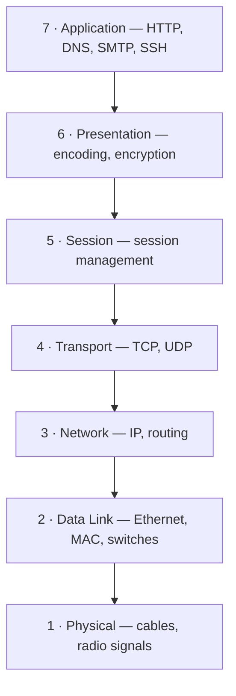

> An RJ45 LAN cable itself is **Layer 1** (physical medium); Ethernet framing is Layer 2.

### TCP vs UDP

| TCP | UDP |
|---|---|
| Connection-oriented, reliable, ordered | Connectionless, no delivery guarantee |
| Retransmission / flow control | Low overhead, low latency |
| HTTP(S), SSH, databases | DNS, streaming, real-time traffic |

### Common ports

| Service | Port |
|---|---:|
| SSH | 22 |
| HTTP | 80 |
| HTTPS | 443 |
| SMTP / submission | 25 / 587 |
| DNS | 53 |
| MySQL/MariaDB | 3306 |
| PostgreSQL | 5432 |
| MongoDB | 27017 |
| Tomcat (default) | 8080 |

### AWS Security Groups (stateful firewall)

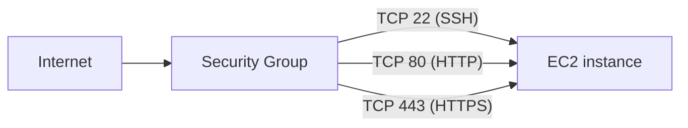

Return traffic for an allowed connection is auto-permitted (**stateful**). Restrict admin ports (22) to trusted IPs, keep 80/443 open as needed.

---

## 14. Backup, Compression & Cron

```bash
tar -czf backup-$(date +%F).tar.gz /etc /var/www   # create
tar -tzf backup-2026-09-22.tar.gz                   # list
tar -xzf backup-2026-09-22.tar.gz                   # extract
```

```bash
crontab -e            # edit schedule
crontab -l            # list
```

```cron
# minute hour day month weekday   command
30 2 * * * /usr/local/bin/backup.sh   # daily at 2:30 AM
```


> **A backup is trustworthy only after a restore has been tested.**

---

## 15. 🚑 Troubleshooting Cheat Sheet

Use this section first when something's broken.

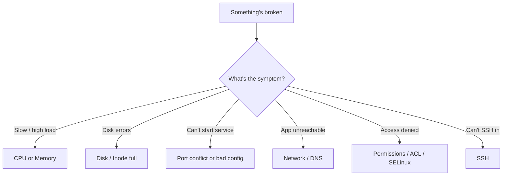

| Symptom | Commands |
|---|---|
| **CPU high** | `top` · `ps aux --sort=-%cpu \| head` · `pidstat 1` |
| **Memory high** | `free -h` · `ps aux --sort=-%mem \| head` |
| **Disk full** | `df -h` · `du -xhd1 / \| sort -h` · `du -sh /var/log/*` |
| **Inode full** | `df -i` |
| **Port already in use** | `sudo ss -lntp \| grep :8080` · `sudo lsof -nP -iTCP:8080 -sTCP:LISTEN` |
| **Service failed** | `systemctl status myapp` · `journalctl -u myapp --since "30 min ago"` |
| **DNS problem** | `getent hosts example.com` · `dig example.com` · `resolvectl status` |
| **Network path problem** | `ip addr` · `ip route` · `ping GATEWAY_IP` · `curl -v http://HOST:PORT` |
| **Permission denied** | `ls -ld /path` · `namei -l /path` · `getfacl /path` · `id` |
| **SSH problem (client)** | `ssh -vvv user@host` |
| **SSH problem (server)** | `sudo systemctl status ssh` · `sudo journalctl -u ssh` |

### The universal troubleshooting method

```text
1. Understand the symptom
2. Gather evidence
3. Identify the layer (app / OS / network / disk)
4. Run the smallest useful command
5. Change ONE thing at a time
6. Verify the result
7. Prevent recurrence
```

> This mindset matters more than memorizing hundreds of commands — most Linux interview questions are **scenario-based**, not trivia.

### Worked example: "sudo rm -rf" fails even though I'm in the sudo group

```bash
sudo -l                       # is the exact command/path allowed?
mount | grep ' ro[ ,]'        # is the filesystem read-only?
lsattr -d /some/path          # is the immutable attribute set?
getfacl /some/path            # ACL restriction?
getenforce                    # SELinux
sudo aa-status                # AppArmor
```

### Worked example: port already in use after restarting an API

```bash
sudo ss -lntp | grep :8080     # who's holding the port?
sudo lsof -i :8080
kill -15 <old_pid>             # graceful first
# then start the new process
```

---

## 16. 🎯 Interview Questions

| # | Question | Short answer |
|---|---|---|
| 1 | Root vs sudo user? | Root is UID 0, unrestricted superuser. A sudo user is a regular account authorized to run selected commands with elevation. |
| 2 | What is `/etc/sudoers`? | The main sudo policy file — edit it with `visudo`. |
| 3 | Why `visudo`? | It validates syntax before saving, preventing a lockout from a typo. |
| 4 | `rmdir` vs `rm -rf`? | `rmdir` only removes empty dirs; `rm -rf` removes recursively and forcibly. |
| 5 | What is `/etc/skel`? | Template files copied into a **new** user's home directory. |
| 6 | What does `chmod 755` mean? | Owner `rwx`, group `r-x`, others `r-x`. |
| 7 | Purpose of `chgrp`? | Changes a file/directory's group ownership. |
| 8 | List available shells? | `cat /etc/shells` or `getent shells`. |
| 9 | Change a user's shell? | `chsh -s /bin/bash username`. |
| 10 | Find the process using port 8080? | `sudo lsof -i :8080` or `sudo ss -lntp \| grep :8080`. |
| 11 | `kill -9` vs `kill -15`? | `-9` (SIGKILL) is immediate and uncatchable; `-15` (SIGTERM) asks for graceful shutdown. |
| 12 | What is a zombie process? | A finished child whose exit status the parent hasn't collected yet. |
| 13 | `top` vs `ps`? | `top` is a live updating view; `ps` is a scriptable snapshot. |
| 14 | What does `systemctl reload` do? | Re-reads config without a full stop/start, if the service supports it. |
| 15 | Where do you check systemd logs? | `journalctl -u service-name`. |

### Rapid-fire concepts to be ready to explain

- Difference between TCP and UDP, and one example of each
- OSI model, 7 layers, from memory
- Difference between `git`-style version control and Linux permissions (don't mix them up!)
- Public vs private IPv4 ranges (`10.0.0.0/8`, `172.16.0.0/12`, `192.168.0.0/16`)
- What a security group does and why it's "stateful"
- Difference between growing a partition and growing a filesystem
- Why a backup isn't trustworthy until a restore has been tested

---

## 17. Golden Rules for Production Linux

```text
1. Verify before deleting.
2. Prefer least privilege over `sudo ALL`.
3. Use `visudo` for sudo policy changes.
4. Never use `chmod 777` as a generic fix.
5. Prefer graceful termination (SIGTERM) before `kill -9`.
6. Check logs and evidence before restarting services.
7. Backups are incomplete until a restore has been tested.
8. Distinguish partition growth from filesystem growth.
9. Keep SSH private keys secret and correctly permissioned.
10. Practice destructive commands only on disposable VMs.
```

### Mental model, all together

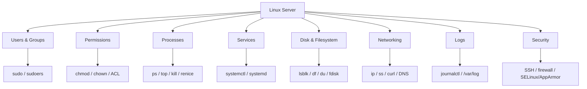

---

## 🙏 Thank You

Thank you for going through these Linux notes! I built this to make revision fast and troubleshooting practical, not just command memorization.

If it helped you:

- ⭐ Star the repository
- 🐛 Open an issue if you spot something to correct
- 🤝 Share it with someone preparing for a DevOps interview

Wishing you a smooth troubleshoot and a confident interview. Happy learning! 🚀

---

**Author:** Shubham Nishane · GitHub: [@shubhamnishane-064](https://github.com/shubhamnishane-064)
